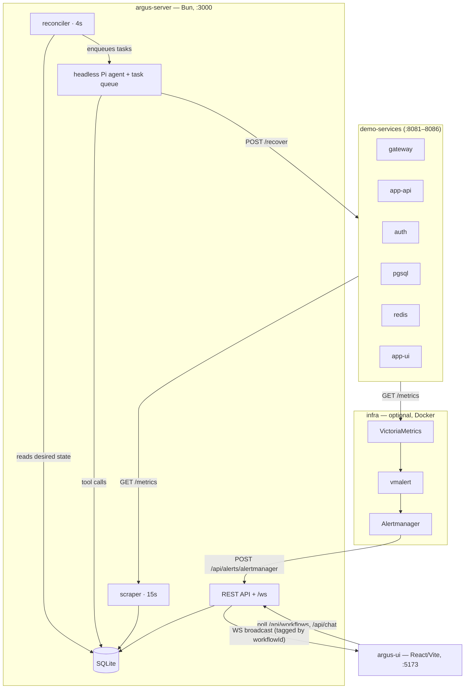
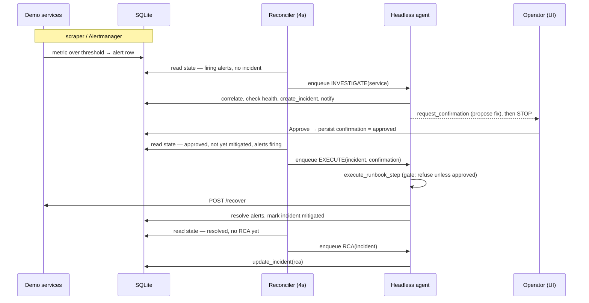
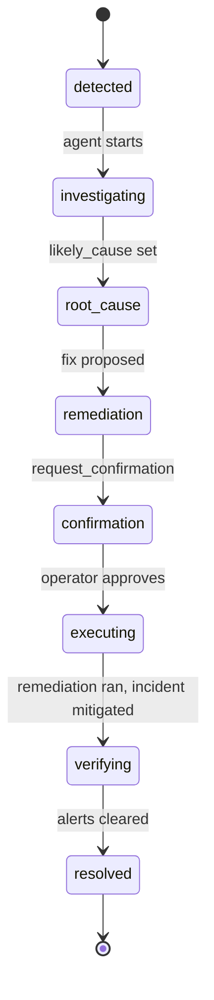

# Argus — Architecture

Argus is a reference architecture for an **autonomous incident-triage agent**. It watches a
demo microservices stack, and when services degrade it investigates, opens an incident,
proposes a fix, waits for a human to approve, executes the remediation, and writes a
root-cause analysis, mostly on its own.

It is a **demo / reference system, not a product**. The failure scenarios are scripted, the
runbook "commands" hit mock `/recover` endpoints, and a single sequential agent session
won't scale to a real org's alert volume. What it _is_ meant to be is an honest, working
illustration of how to wire an LLM agent into an operational control loop, and more specifically
of **where such a system needs determinism and where it needs judgment.**

That boundary is the thesis of this document.

---

## 1. System overview



| Component | Stack | Port | Responsibility |
|---|---|---|---|
| **argus-server** | Bun | 3000 | Headless agent, reconciler, REST API, alert scraper, WebSocket |
| **argus-ui** | React + Vite | 5173 | Display-only triage console (pipeline, incidents, chat) |
| **demo-services** | Bun | 8081–8086 | Six mock services with `GET /metrics`, `POST /fail`, `POST /recover` |
| **infra** | Docker Compose | — | VictoriaMetrics + vmalert + Alertmanager (optional alert source) |
| **runbooks/** | YAML | — | Per-service triggers, steps, known failure patterns |
| **SQLite** | `argus-server/argus.db` | — | The single source of truth for all state |

The service topology is a deliberately classic cascade shape:

```
gateway → app-ui, app-api
app-api → auth, pgsql, redis
auth    → pgsql, redis
pgsql, redis = foundational (their failure cascades upward)
```

This is what makes correlation interesting: when five services alert at once, the agent's
job is to find the one foundational service actually at fault.

### Built on

Argus is the *system* assembled around off-the-shelf foundations. It is not a from-scratch
agent framework:

- **[Pi](https://github.com/earendil-works/pi-coding-agent)** (`@earendil-works/pi-coding-agent`)
  — the agent harness. It owns the **inner loop**: within a single turn, *model → tool call →
  observe result → repeat → final answer*, plus session lifecycle and token streaming. Argus
  registers its 12 domain tools with Pi and drives Pi sessions; it does not reimplement this
  per-turn loop.
- **Ollama** — serves the local LLM the agent reasons with (`OLLAMA_BASE_URL` / `OLLAMA_MODEL`).
- **Bun** — runtime for the server and the demo services.
- **React + Vite** — the display-only console.
- **VictoriaMetrics + vmalert + Alertmanager** — the optional Prometheus-style alerting path.

**Two loops, and the split is the point.** Pi runs the *inner* per-turn tool-calling loop;
Argus implements the ***outer* control loop**: the reconciler (§3.2) that decides which turns
to run and when, and sequences the multi-turn lifecycle (investigate → await approval → execute
→ RCA). The rest of what is **original to Argus** hangs off that outer loop: the durability
model (operational state and conversation both reconstructable from SQLite), the
human-in-the-loop approval gate with agent-executed remediation, the ask-the-operator RCA
pattern, and the explicit determinism/agency boundary. The harness is substrate; the
operational control loop is the contribution.

---

## 2. Two ways alerts arrive

Argus supports two ingestion modes that converge on the same DB state:

- **`mise run dev` (built-in scraper):** the server polls each service's `/metrics` every
  **15s**, compares against thresholds, and creates/resolves `alerts` rows directly. No Docker.
- **Prometheus-style (built-in scraper disabled, `DISABLE_SCRAPER=1`):** VictoriaMetrics
  scrapes metrics, vmalert evaluates alerting rules, and Alertmanager posts firing/resolved
  alerts to `POST /api/alerts/alertmanager`. This runs in two topologies:
  - **`docker compose up`** — *everything* in Docker (services, server, observability) on one
    compose network, addressed by service DNS (`argus-server:3000`, `gateway:8081`). argus-server
    also serves the built UI single-origin at http://localhost:3000 (app + `/api` + `/ws` on one
    port, no UI proxy, so the live-chat WebSocket connects instantly). The agent reaches Ollama
    on the host via `host.docker.internal`. One command, fully reproducible.
  - **`mise run infra:start`** — observability in Docker, services/server/UI native; the
    containers reach the host via `host.docker.internal`.

Everything downstream of "an `alerts` row exists" is identical. **Alert _detection_ is
deterministic infrastructure; it is never the agent's job.** This is the first place the
determinism boundary shows up.

---

## 3. The agentic core

### 3.1 A headless, server-side agent

A single persistent [Pi](https://github.com/earendil-works/pi-coding-agent) session runs
**inside `argus-server`**, created at boot, not per browser tab. Moving the agent server-side was the structural decision that made everything else work, and it was not the first design.

> **Evolution:** Argus originally ran the agent inside the browser's WebSocket session. That
> made autonomy depend on someone having the tab open, and a page refresh tore down the
> in-flight work. Moving the agent server-side made the browser **display-only**: it renders
> streamed output and sends operator chat, but the agent's existence and progress no longer
> depend on it.

Tasks are processed through a **sequential queue**. Streamed output (text deltas, tool
start/stop, completion) is broadcast to _every_ connected UI, each message tagged with a
`workflowId` so clients route it into the correct incident's chat.

### 3.2 The reconciler: desired state, not events

The agent does not act on events. A **reconciler loop runs every 4s**, re-derives the
desired set of actions purely from SQLite, and enqueues whatever is missing:



The three reconciler rules:

| Rule | Condition (derived from DB) | Action |
|---|---|---|
| **Investigate** | service has firing alerts, no incident | enqueue investigation → `create_incident` |
| **Execute** | confirmation `approved`, incident not yet mitigated, alerts firing | enqueue `execute_runbook_step` |
| **RCA** | incident resolved, `rca` is null | enqueue RCA write (`update_incident`) |

> **The central insight:** treating agent work as **state to reconcile toward** rather than
> **events to fire** is what makes the whole system durable. This is the same idea behind a
> Kubernetes controller or a Temporal workflow, applied to an LLM. Because the reconciler
> recomputes from the DB every tick:
>
> - autonomy **survives a server restart**. On reboot it re-derives what still needs doing.
> - It needs **no connected browser**. Actions run server-side regardless.
> - **Approval is durable**. Clicking Approve just persists a row; the reconciler does the rest.
> - It **self-corrects**. A dropped task reappears on the next tick.
>
> The earlier design broadcast "do this now" directives to clients. They were fire-and-forget:
> if no browser caught one, the action was lost. Replacing directives with reconciliation
> removed an entire class of "it didn't run" bugs.

In-memory guards dedupe within a run (so a task isn't enqueued twice while in flight); they
reset on restart, which is fine. The DB conditions are the real guard, and a completed
action no longer matches its rule.

**Historical context at dispatch.** The Investigate rule feeds the agent more than the live
alert. When an investigation is enqueued, the prompt (`investigatePrompt` in `server.ts`) is
assembled with the **last three resolved incidents where that service was the root cause**,
their `likely_cause` and RCA, queried from SQLite at dispatch time. That is deterministic code
handing the model structured history, so it can recognize a recurring failure without
re-investigating from scratch. The agent's judgment is informed by past state, not just live
signals, and the prompt explicitly tells it to verify current evidence before assuming the same
fix applies.

### 3.3 The toolbelt (12 tools)

The agent's only access to the world is its tools. It never writes raw SQL or invents
metric values:

`get_alert` · `list_active_alerts` · `check_service_health` · `check_logs` ·
`get_recent_deployments` · `search_runbooks` · `create_incident` · `update_incident` ·
`list_incidents` · `notify_channel` · `request_confirmation` · `execute_runbook_step`

There is deliberately **no git / shell / write-anything tool**: Argus triages incidents, it
does not change code or infrastructure beyond the one gated remediation primitive.

---

## 4. Human-in-the-loop: the approval gate

The key safety property is that **the agent never executes remediation
without a human approval on record.** The flow:

1. Agent investigates and calls `request_confirmation` with a proposed step, then **ends its
   turn**. It does not proceed.
2. The operator clicks **Approve** in the UI → `POST /api/confirmations/:id/approve` flips the
   row to `approved`. That's all the endpoint does; the approval is now durable.
3. The reconciler sees `approved + not mitigated + alerts firing` and enqueues execution.
4. The agent calls `execute_runbook_step`, which **re-checks the gate** (refuses unless the
   confirmation is `approved`), then performs the real recovery: `POST /recover` on the
   affected services, resolves their alerts, marks the incident mitigated.

The gate is enforced in two independent places: the UI flow and the tool itself. The agent cannot talk itself past it.

> **Evolution:** an earlier version had the _server_ perform the recovery directly on approve.
> It worked, but it meant the "agent" wasn't actually doing the remediation. Moving execution
> into `execute_runbook_step` made the agent the actor again, with the gate intact. Proposal
> is the LLM's, execution is the LLM's, **authorization is the human's.**

### The RCA branch: asking the human

When alerts clear, the reconciler enqueues an RCA. There are two cases, and the second is the
more interesting pattern:

- **Agent remediated** (an approved confirmation exists) → the agent already knows the cause
  and fix; it writes the RCA directly.
- **Resolved externally** (no approved remediation: it auto-healed or someone fixed it out of
  band) → the agent **asks the operator how it got resolved**, _and_ does its own research
  (current health, recent deployments, metric trends), then writes an RCA combining both.

That second branch, where the agent solicits human knowledge it cannot observe and then merges it with its own findings, is a small but genuinely useful agentic pattern.

---

## 5. The workflow state machine

The UI never invents state. `GET /api/workflows` derives a pipeline stage per service from
`alerts + incidents + confirmations + correlations`, and the UI polls it every **3s**.



`computeWorkflowStep` resolves the stage from observable facts (alerts cleared → `resolved`;
incident `mitigated` but alerts still firing → `verifying`; `approved` confirmation →
`executing`; pending confirmation → `confirmation`; an incident with a `likely_cause` →
`root_cause`/`remediation`; etc.).

Two subtleties worth noting:

- **Workflow identity.** A fresh failure with no incident is a *pending* workflow keyed
  `svc-<service>-<firstAlertAt>`. Once the agent opens an incident it becomes `inc-<id>`. This
  id change matters for chat persistence (see §6).
- **One workflow per service.** The agent doesn't always correlate every firing alert to the
  incident. To avoid showing a phantom second "detected" workflow for the same service, any
  orphan firing alerts on a service that already has an open incident are **folded into that
  incident's workflow** rather than spawning a duplicate.

---

## 6. Durability

Two kinds of state must survive a refresh or restart. They're handled differently, on purpose.

### 6.1 Operational state → reconciliation

Incidents, alerts, confirmations, pipeline stage, and RCA all live in SQLite and are recomputed
on every poll and every reconciler tick. A browser refresh re-fetches them; a server restart
re-derives pending _actions_ from them. Nothing here is held in memory as the source of truth.

### 6.2 Conversation state → a persisted transcript

The agent's chat is the one thing that _was_ only in memory, and making it durable took a bit
more care because the thread identity changes mid-incident.

- Every operator and agent message is written to a **`messages`** table, keyed by the
  `workflowId` that was active when it was emitted. The agent's reply is persisted when its
  turn completes.
- Because investigation streams under the *pending* `svc-…` id but everything after the
  incident is created streams under `inc-<id>`, a **`thread_aliases`** table records
  `svc-… → inc-<id>`. `GET /api/chat` resolves aliases at query time, so the full transcript, investigation included, surfaces under the incident.
- On load the client fetches `/api/chat` **before** opening the WebSocket, so history is in
  place before any live delta arrives (no snapshot-vs-stream race).
- If a client connects **mid-stream**, the server seeds it with the in-progress response buffer
  (`agent_seed`) so a refresh during a reply doesn't drop the partial text.

The net effect: the agent keeps working while the browser is closed, and the conversation is
intact when you come back, whether the agent was mid-thought or finished.

---

## 7. The determinism / agency boundary

The line between deterministic code and the LLM is the thing to take from this architecture:

| Deterministic code owns… | The LLM agent owns… |
|---|---|
| Detecting alerts (scraper / Alertmanager) | Correlating alerts across services |
| Deciding *when* to act (reconciler) | Diagnosing the root cause |
| Computing workflow / pipeline state | Proposing a remediation step |
| Enforcing the approval gate | Writing the incident + RCA narrative |
| Performing the DB writes & `/recover` call | Asking the operator the right question |
| Persisting transcript & aliasing threads | Judgment under ambiguity |
| Shipping & indexing logs (future) | Reading a log line and deciding what it means |

Detection, scheduling, state, and safety are **mechanism**: they must be predictable, so they
are code. Correlation, diagnosis, and explanation are **judgment**: they benefit from a model.
Keeping the model out of the control loop's mechanics is what makes an autonomous agent safe to
run unattended. Not everything splits that cleanly; the last row in the table straddles the
boundary, and that's where the interesting design questions live.

### 7.1 Instrumenting the agentic side

The boundary has a corollary for observability. The deterministic side is controlled *by
construction*: you can read the code and know what it will do. The agentic side cannot be
pinned that way: it is non-deterministic and metered (tokens cost money, turns take time). So
the other lever is **instrumentation**: you make the model layer measurable instead of trying to
make it predictable.

Argus already scrapes the six demo services' `/metrics` through VictoriaMetrics. The agent now
emits its own, so **it becomes a monitored service in its own stack**. The monitor monitors itself. `argus-server` exposes `GET /metrics` (Prometheus text), scraped via a dedicated
`argus-server` job (`infra/config/scrape.yml` for `infra:start`; `infra/config/scrape.compose.yml`,
which targets `argus-server:3000`, for the full Docker stack):

- `argus_agent_tokens_{input,output,cache_read,cache_write}_total`, `argus_agent_tokens_total`
  and `argus_agent_cost_usd_total`, read from the Pi session's `getSessionStats()` at scrape time.
- `argus_agent_turns_total`, `argus_agent_turn_duration_ms_{sum,count}`, `argus_agent_turn_last_ms`
  — turn count and latency (e.g. avg latency = `_sum / _count`).
- `argus_agent_tool_calls_total{tool="…"}`: tool-use breakdown by tool name.
- `argus_agent_errors_total`, `argus_agent_queue_depth`, `argus_agent_busy`, and an
  `argus_agent_info{model,provider}` build-info gauge.

Counters live in process memory and reset on restart / `bun --watch` reload, which is standard for a
process-level exporter. Prometheus/VictoriaMetrics handle counter resets natively. The endpoint
is always live, so it is curl-able under `mise run dev` even without the VictoriaMetrics stack.

---

## 8. Data model

```
services        — the six monitored services and current status
alerts          — firing/resolved alerts with metric + threshold
incidents       — title, description, likely_cause, rca, root_cause_service, status
incident_alerts — many-to-many correlation (which alerts belong to an incident)
deployments     — recent deploys (the agent checks these for "what changed")
notifications   — Slack-style messages sent per incident
confirmations   — remediation approvals (pending / approved / declined)
messages        — durable chat transcript (thread_key, role, content, auto)
thread_aliases  — maps a pending svc-thread to the inc-<id> it became
```

All access goes through `argus-server/db/api.ts`; tools and handlers never embed SQL.

---

## 9. Key design decisions & tradeoffs

- **Single shared agent session.** Simple, and it serializes work so concurrent failures don't
  interleave. The tradeoff: no parallel triage across services, and one growing context. A
  per-service session pool would fix both, a clear next step intentionally deferred.
- **Reconciliation over events.** More DB reads, but eliminates lost-work bugs and makes the
  system restart-safe and browser-independent. Worth it.
- **`bun --watch` in dev.** Server edits hot-reload; a reload drops in-memory agent/chat state,
  but the reconciler re-derives actions and the transcript reloads from `/api/chat`, so nothing
  gets stuck.
- **SQLite as the only source of truth.** Everything reconciles from it; in-memory state is
  always reconstructable. This is what makes "just restart it" a safe operation.

---

## 10. Limitations & non-goals

- Failure scenarios are **scripted** (`POST /fail` / `POST /recover`); this is not chaos
  engineering.
- Remediation is **simulated** against mock endpoints. No real infrastructure is touched.
- A single session won't handle **production alert volume**; this is an architecture demo.
- Autonomy **requires the model to be reachable** (Ollama in dev); if it's down, detection and
  state still work, but triage pauses (the reconciler no-ops until the agent is up).
- Narrow restart edge: if the server restarts in the seconds between an investigation finishing
  and the incident being aliased, that one transcript can stay under the pending thread.

---

## 11. Repository layout

```
argus-server/        Bun server (TypeScript): agent, reconciler, REST API, scraper, WS
  server.ts          entry point: all of the above wired together
  service-url.ts     resolves demo-service base URLs (localhost vs compose DNS, SERVICE_DNS)
  metrics.ts         Prometheus exposition for the agent's own model usage (GET /metrics)
  agent/             system prompt
  tools/             the 12 agent tools (argus-tools.ts)
  db/                schema.ts (tables + migrations), api.ts (all queries), types.ts (domain model)
  Dockerfile         multi-stage server image: builds the UI, then serves it + API + /ws on :3000
argus-ui/            React + Vite display-only console (TypeScript, src/main.tsx, src/types.ts)
demo-services/       six mock microservices (TypeScript)
  Dockerfile         one image for all six; command per service
runbooks/services/   per-service YAML runbooks
docker-compose.yml   full reference stack in one command (services + server + observability)
infra/               infra-only Docker Compose (VM + vmalert + Alertmanager) + DNS/host config variants
.mise/tasks/         infra:up / infra:down (full Docker) · infra:start / infra:stop (hybrid) · infra:demo
```

---

## 12. Running it

```bash
# Everything in Docker, one command (Ollama must be running on the host):
docker compose up --build        # or: mise run infra:up

# — or — native inner loop (built-in scraper, hot-reload):
mise run install
mise run dev                     # server + UI + 6 demo services

# — or — hybrid (Docker observability + native services):
mise run infra:start

# drive a scenario, then watch Argus triage it autonomously (works in any mode):
mise run infra:demo -- db        # database cascade   (root cause: pgsql)
mise run infra:demo -- auth      # auth outage        (root cause: auth)
mise run infra:demo -- cache     # cache eviction     (root cause: redis)
mise run infra:demo -- recover   # restore everything
```

Open the UI at `http://localhost:5173`, trigger a scenario, and watch the pipeline advance
from **Detected** through to **Resolved**, approving the one remediation step when Argus asks.
